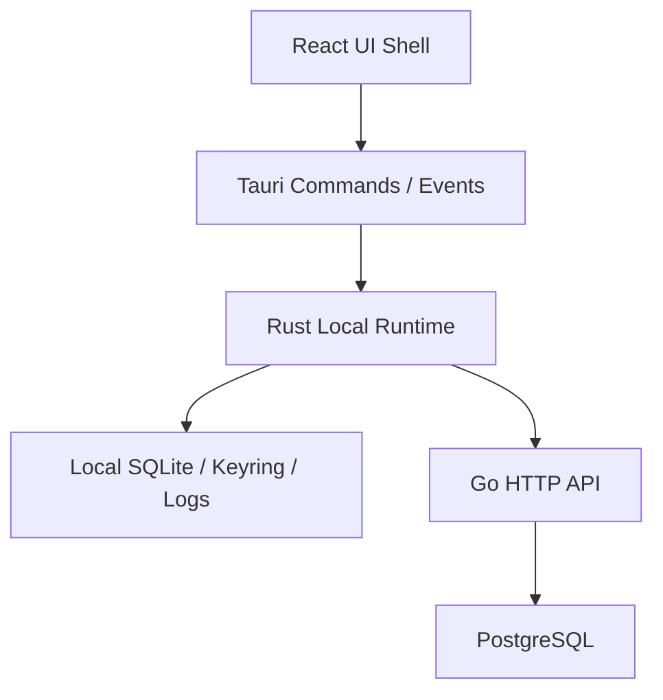

# AigcFox desktop-v3 详细设计

## 文档定位

本文档用于把 `desktop-v3 Wave 1 Skeleton` 的模块拆分和数据边界设计清楚。

当前只讨论骨架：

- React 壳层怎么分
- Tauri commands 怎么分
- Rust local runtime 怎么分
- 本地 SQLite 和远端 Go API 的边界怎么分
- 响应式布局怎么落

## 总体架构



## 当前范围

当前只保留：

- App Shell
- Layout Shell
- Route Shell
- Command Boundary
- Rust Runtime Boundary
- Local Storage Boundary
- Diagnostics Boundary

当前不进入业务域实现。

## React 侧模块设计

建议目录按职责拆开：

```text
apps/desktop-v3/
  src/
    app/
      router/
      layout/
      providers/
    pages/
    features/
    components/
    lib/
      runtime/
      errors/
      query/
    styles/
```

### `app/router`

职责：

- 路由声明
- 路由守卫占位
- 页面级懒加载边界

### `app/layout`

职责：

- 侧边栏
- 顶部区
- 主内容容器
- 响应式布局切换

### `app/providers`

职责：

- React Query provider
- 主题 provider
- Toast provider
- 路由壳层所需全局 provider
- 查询重试策略统一集中在 provider 侧配置，不让页面各自定义重试规则

### `app/*` shell boundary

职责：

- 固定 `App -> AppProviders -> RouterProvider -> AppShell` 的壳层装配顺序
- 固定 `renderer-ready` bootstrap、layout shell、provider shell 与 router shell 的 source-level ownership
- 固定当前 Wave 1 允许出现的初始路由集、导航 href 与 layout mode

补充规则：

- 当前 `pnpm qa:desktop-v3-app-shell-governance` 会同时冻结 `src/app/App.tsx`、`src/app/bootstrap/renderer-ready.ts`、`src/app/layout/*`、`src/app/providers/*`、`src/app/router/*` 的文件集与顶层声明面
- 当前同一条 gate 还会冻结 `"/" / "/diagnostics" / "/preferences"` 初始路由与 `primaryNavigationItems / secondaryNavigationItems` 的 href 集，不允许补丁式扩壳层路由拓扑
- `main.tsx` 只允许直接持有 `App` 与 `renderer-ready`；`App` 只允许直接持有 `AppProviders` 与 `appRouter`；`routes.tsx` 只允许直接持有 `AppShell`；`app-shell.tsx` 只允许直接持有 `PageHeader / ShellScaffold / Sidebar`
- 只要 app shell 要新增 provider、bootstrap 阶段、layout helper、路由层或跨页面壳层状态，就不能继续在当前结构上叠补丁，必须先重写 `src/app` boundary，再同步更新门禁与文档

### `pages` / `components` / `hooks` presentation boundary

职责：

- `src/pages/*` 只做页面组合与静态展示，不直接持有 runtime adapter 或额外壳层编排
- `components/navigation/nav-item.tsx` 只承接 sidebar 单项导航展示
- `components/states/*` 只承接共享 `empty / error / loading` 状态展示
- `hooks/*` 只承接 app shell 范围内的交互与布局辅助，不演化成跨页面运行态容器

补充规则：

- 当前 `pnpm qa:desktop-v3-page-governance` 会同时冻结 `src/pages/dashboard-page.tsx`、`diagnostics-page.tsx`、`preferences-page.tsx`、`components/navigation/nav-item.tsx`、`components/states/*`、`hooks/use-keyboard-shortcuts.ts`、`hooks/use-shell-layout.ts` 的文件集与顶层声明面
- `DashboardPage` 当前只允许保留 `highlights / quickLinks / DashboardPage`，并把 quick link href 固定在 `"/diagnostics"` 与 `"/preferences"`
- `DiagnosticsPage` 当前只允许保留 `diagnosticsOverviewQueryKey / DiagnosticsCard / DiagnosticsPage`；`PreferencesPage` 当前只允许保留 `themeOptions / PreferencesPage`
- `NavItem`、`EmptyState`、`ErrorState`、`LoadingState` 的 props contract，以及 `LayoutMode / ShellLayoutState / getLayoutState / useShellLayout / isEditableElement / useKeyboardShortcuts` 的公开面，都由同一条 gate 冻结
- `routes.tsx`、`sidebar.tsx`、`diagnostics-page.tsx`、`preferences-page.tsx`、`app-shell.tsx` 当前分别固定承接 page、nav item、state component 与 shell hook ownership；只要要新增页面、横向扩 shared state 或让 hook 继续长成通用运行态，就必须先重写 renderer presentation boundary，再同步更新门禁与文档

### `features/diagnostics` / `features/preferences`

职责：

- page/provider 与 `lib/runtime` 之间的唯一 feature 过渡层
- `diagnostics-api` 聚合 runtime probe 与本地 diagnostics snapshot，不让页面直接持有 `getDesktopRuntime`
- `preferences-api` 与 `preferences-store` 共同管理主题偏好读写与 renderer 本地主题状态
- `diagnostics-types` / `preferences-types` 负责 feature 边界上的 view-model 与类型重导出
- 当前 `pnpm qa:desktop-v3-feature-governance` 会同时冻结 `src/features/diagnostics` 与 `src/features/preferences` 的文件集、顶层声明面、`DiagnosticsOverview / ThemePreferenceState` 形状，以及 `DiagnosticsPage / PreferencesPage / ThemeProvider` 的 source-level ownership；任何新的 feature helper、页面直连 runtime 或 provider 侧横向扩散都必须先重写 feature boundary

### `lib/runtime`

职责：

- 统一封装 desktop runtime
- 屏蔽 Tauri command 与 browser mock runtime 的差异
- 不让组件层散落原始 command 调用
- 做 TypeScript 侧错误归一和契约对齐
- `contracts.ts / desktop-runtime.ts / tauri-command-types.ts` 与 Rust `runtime/models.rs` 共同组成跨边界 contract truth chain，当前由 `pnpm qa:desktop-v3-runtime-contract-governance` 冻结；字段、联合类型、方法签名和 command payload/result map 不允许各改各的
- `mock-command-runtime.ts / mock-fixtures.ts / runtime-mode.ts / runtime-registry.ts / tauri-bridge.ts / tauri-command-runtime.ts / tauri-invoke.ts` 组成 renderer runtime adapter skeleton，当前由 `pnpm qa:desktop-v3-runtime-adapter-governance` 冻结；不允许继续在现结构上散落实例化入口、bridge helper 或 Tauri import
- Tauri command adapter 需要可独立验证 command 名、payload 透传和 invoke 错误归一
- Windows 宿主验证拆成两段：`tauri dev` 只证明宿主窗口真实启动；packaged runtime smoke 才作为 renderer / invoke / backend 主证据
- 当前默认开发环境固定为 `Windows + WSL2`，真实窗口 proof 默认在固定 `WSL` 单执行面下通过 `WSLg` 完成；不要把 `WSLg` 特定图形兼容处理当作唯一主链前提，也不要把同一条验证链切回 `PowerShell`

默认原则仍然是：优先走 command，而不是让页面直接发 HTTP。

补充约束：

- 页面、hooks、features 不直接 import 其他 Tauri JS API
- renderer 进入宿主能力的唯一入口保持在 `src/lib/runtime/*`
- 新增宿主能力时，先改 runtime adapter，再改页面
- `getDesktopRuntime` 当前只允许被 `renderer-ready`、diagnostics API 和 preferences API 直接持有；`resolveDesktopRuntimeMode` 只允许留在 `runtime-registry` 与 `renderer-ready`
- `@tauri-apps/*` import 与 `__TAURI_INTERNALS__` bridge probing 当前只允许收敛在 `tauri-bridge.ts`
- `renderer-ready` 只允许留在 `src/app/bootstrap/renderer-ready.ts`，当前由 `pnpm qa:desktop-v3-app-shell-governance` 与 `pnpm qa:desktop-v3-runtime-adapter-governance` 共同冻结；任何新的 boot probe、额外 bootstrap helper 或跨页面 boot state 都必须先重写 app shell / runtime adapter 边界
- `DiagnosticsPage` 只允许通过 `getDiagnosticsOverview` 与 `formatSecureStoreSummary` 读取诊断态；`PreferencesPage` 与 `ThemeProvider` 只允许通过 `preferences-api / preferences-store / preferences-types` 持有主题偏好与 renderer 主题状态

### `lib/errors`

职责：

- 统一 `ApiError / CommandError`
- 统一页面反馈需要的错误结构
- 把统一错误对象格式化为错误态可见的 support details，例如 `code / requestId / runtime message`
- 当前 `pnpm qa:desktop-v3-support-governance` 会同时冻结 `app-error.ts`、`error-support-details.ts`、`normalize-command-error.ts` 的文件集、顶层声明面，以及 `AppErrorShape / ErrorSupportDetail / CommandErrorPayload` 的属性合同；任何新的错误 helper、字段或横向扩散都必须先重写 renderer error support boundary
- `AppError` 当前只允许由 `normalize-command-error.ts` 与 `mock-command-runtime.ts` 直接持有；`buildErrorSupportDetails` 只允许由 `ErrorState`、`DiagnosticsPage`、`PreferencesPage` 直接持有；只要错误支撑链跨出当前 ownership，就先重写 support layer，再同步更新门禁与文档

### `lib/query`

职责：

- 集中管理 `QueryClient`
- 集中管理 query retry 策略
- 当前骨架固定：`not_ready` 不重试，其他错误最多重试一次
- 当前 `pnpm qa:desktop-v3-support-governance` 会同时冻结 `query-client.ts`、`query-retry-policy.ts` 的文件集、顶层声明面和 ownership；`queryClient` 只允许由 `app-providers.tsx` 直接持有，`shouldRetryDesktopQuery` 只允许由 `query-client.ts` 直接持有，不允许继续补丁式扩 query singleton、重试分支或跨页面实例化入口

### shared renderer support

职责：

- `notify.ts` 统一承接 renderer toast 支撑，不让页面和 hook 各自再包一套消息层
- `typography.ts` 统一承接基础 type token，不让页面和 layout 壳层各自散落标题/说明文字等级
- `utils.ts` 统一承接 `cn` class merge helper，不让 UI primitive 与页面层重复引入第二套 class merge 工具

补充规则：

- 当前 `pnpm qa:desktop-v3-support-governance` 会同时冻结 `notify.ts`、`typography.ts`、`utils.ts` 的文件集、顶层声明面、`notify` key 集、`typography` token 集与 `cn` helper ownership
- `notify` 当前只允许由 `PreferencesPage` 与 `useKeyboardShortcuts` 直接持有；`typography` 当前只允许由 `PageHeader` 与三张骨架页面直接持有；`cn` 当前只允许留在 `ShellScaffold`、`Sidebar`、`NavItem` 与当前 `components/ui/*` primitive 内
- 只要 toast 支撑、type token 或 class merge helper 要跨出当前最小边界，就必须先结构化重写 shared support layer，再同步更新门禁与文档

## Rust 侧模块设计

建议按职责拆开：

```text
src-tauri/
  src/
    commands/
    runtime/
      client/
      localdb/
      diagnostics/
      state/
      security/
```

### `commands`

职责：

- 暴露受控 command
- 做参数接收
- 把请求转给 runtime

规则：

- command 文件保持小而薄
- 默认不在 command 里拼复杂本地 I/O 和远端编排
- 含 I/O 的 command 优先走 `async`

### `runtime/client`

职责：

- 调用 Go HTTP API
- 统一远端响应解析
- 统一把远端错误转换为本地错误
- 保留 request id 等远端 envelope 元数据，继续向上游 UI 透传

补充规则：

- 当前 `runtime/client` 只允许停留在 probe-only skeleton：`BackendClient` 只承接 `liveness / readiness`
- 当前用 `pnpm qa:desktop-v3-backend-client-governance` 冻结 `runtime/client` 文件集、`BackendClient` 公开面、probe contract 导出面、`reqwest` 触点和模块外持有面
- 只要远端能力从 health probe 扩到真实业务 API、列表、写入或复杂编排，就不能继续在当前结构上叠补丁；必须先重写 remote client 分层，再放开门禁

### `runtime/localdb`

职责：

- 打开 SQLite
- 管理 `rusqlite_migration`
- 提供本地偏好和缓存读写

补充规则：

- 当前同步 `rusqlite` 只承接 Wave 1 的小数据骨架
- 一旦进入列表、批量写入、复杂查询或同步编排，必须先重写为独立 blocking adapter，再继续扩功能

### `runtime/diagnostics`

职责：

- 记录本地诊断信息
- 为 UI 提供最小健康快照
- 当前用 `pnpm qa:desktop-v3-runtime-skeleton-governance` 冻结 `DiagnosticsService` 的文件集、私有字段、`new / snapshot` 公开面和外部持有面；如果诊断聚合要扩成多层编排、缓存或附加 service，就先重写该模块

### `runtime/state`

职责：

- 承接本地会话态、缓存索引和轻量运行态
- 为 diagnostics 提供最小运行态快照，例如最近一次 backend probe 时间
- 当前用 `pnpm qa:desktop-v3-runtime-skeleton-governance` 冻结 `SessionSnapshot.last_backend_probe_at` 与 `SessionState.record_backend_probe / snapshot`；如果要把更多会话上下文、缓存索引或派生状态塞进当前模块，必须先重写 runtime state 边界

### `runtime/security`

职责：

- secure store / keyring
- 敏感数据裁剪
- 输出结构化 secure store skeleton 快照：`provider / status / writes_enabled`
- Wave 1 只保留边界与诊断合同，不落真实密钥写入实现
- 当前用 `pnpm qa:desktop-v3-runtime-skeleton-governance` 冻结 `SecureStoreStatus`、`SecureStoreSnapshot` 和 `SecureStore::snapshot()` 的骨架边界；只要 secure store 要从保留态转成真实探测、真实写入或多 provider 适配，就不能继续在当前结构上打补丁，必须先重写安全模块

### `runtime/models` 与 TypeScript runtime contracts

职责：

- 固定 `renderer -> invoke -> Rust` 之间的结构化数据合同
- 统一 `ThemeMode / ThemePreference / DiagnosticsSnapshot / BackendProbe`
- 固定 `DesktopRuntime` 方法签名与 `DesktopCommandPayloadMap / DesktopCommandResultMap`

补充规则：

- 当前用 `pnpm qa:desktop-v3-runtime-contract-governance` 冻结 `src-tauri/src/runtime/models.rs`、`src/lib/runtime/contracts.ts`、`src/lib/runtime/desktop-runtime.ts`、`src/lib/runtime/tauri-command-types.ts`
- Rust 与 TypeScript 两侧的合同当前只允许停留在 Wave 1 主题偏好、diagnostics snapshot、backend probe 和 renderer boot 证明边界
- 任何新的 runtime snapshot 字段、renderer boot 阶段、command payload/result 字段或命令名扩张，都不能直接在现结构上补丁式追加；必须先重写 contract boundary，再同步更新门禁与文档

## 布局系统设计

当前布局必须按以下规则落地：

- 外层使用 `flex` 或 `grid`
- 侧边栏标准宽度 `240px`
- compact 模式侧边栏宽度 `200px`
- 主内容区 `flex: 1`
- `1920px+` 时内容区内层容器 `max-width = 1400px` 且居中
- `1000px` 到 `1279px` 只允许保护性降级，不允许横向滚动

布局分段：

- `<1366px`：compact
- `1366px - 1919px`：standard
- `1920px+`：centered

## 启动链路

当前骨架启动链建议如下：

1. React 初始化 providers
2. 创建路由壳层
3. 初始化 command client
4. Rust 侧初始化本地数据库与运行时状态
5. UI 请求本地诊断快照
6. 需要远端数据时，通过 command 转发到 Go API

## Tauri 2 专项约束

当前 `desktop-v3` 对 `Tauri 2` 额外固定以下规则：

- capability 文件是安全边界真相，不把权限治理留给“代码约定”
- 新窗口权限绑定依赖 `label`
- 不把 smoke 环境变量演变成业务开关
- `tauri.conf.json` 只放共享配置；平台差异未来进入 `tauri.<platform>.conf.json`
- updater 进入实现前，先补签名、公钥、HTTPS 发布源与产物流向设计

详细规则见 [269-desktop-v3-tauri-2-governance-baseline.md](./269-desktop-v3-tauri-2-governance-baseline.md)。

## 命令链路

当前主链固定如下：

1. 页面调用 `lib/runtime/*`
2. TypeScript 封装调用 Tauri command
3. Rust `commands/*` 接收请求
4. Rust runtime 决定：
   - 只读本地数据
   - 或转发到 Go API
   - 或两者组合
5. Rust 统一返回结构化结果或结构化错误
6. React 页面更新状态

## 本地与远端数据边界

### 只存本地

- 用户偏好
- 布局密度
- 本地缓存
- 本地诊断快照
- 同步辅助标记

### 只存远端

- 权威业务数据
- 云端配置
- 审计真相
- 多端共享状态

### 双边存在，但远端为准

- 只读缓存快照
- 需要离线展示的摘要对象

具体 schema 以 [local-schema.md](./local-schema.md) 为准。

## 错误传递设计

错误链固定如下：

```text
Go error response -> Rust runtime error -> Tauri command error -> TypeScript error object
```

规则：

- Go 负责权威错误码
- Rust 负责本地归一和安全裁剪
- TypeScript 只处理统一错误对象
- 页面错误态默认展示结构化 support details，不在页面里散落手写错误码拼接逻辑

## 预留边界

Wave 1 可以预留目录或接口边界，但不能把它们包装成当前已实现能力。

允许预留的边界类型：

- 云端适配器
- 本地执行适配器
- 更新适配器
- 诊断适配器

## 当前不做的事

- 业务页面实现
- 复杂流程编排
- 自动更新实现
- 本地执行引擎实现
- 将所有逻辑塞进单个 `App.tsx` 或单个 `lib.rs`

## 关联文档

- [257-desktop-v3-replatform-proposal.md](./257-desktop-v3-replatform-proposal.md)
- [258-desktop-v3-technical-baseline.md](./258-desktop-v3-technical-baseline.md)
- [260-desktop-v3-wave1-execution-baseline.md](./260-desktop-v3-wave1-execution-baseline.md)
- [architecture.md](./architecture.md)
- [local-schema.md](./local-schema.md)
