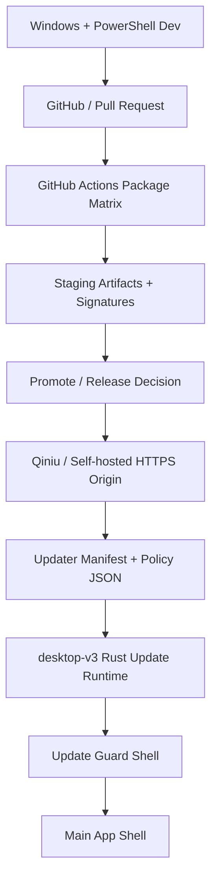

# AigcFox desktop-v3 交付与更新详细设计

## 文档定位

本文档用于把 `desktop-v3 Delivery / Updater Baseline` 的模块边界、数据边界和时序设计清楚。

当前只讨论：

- 构件怎么从 GitHub Actions 进入正式更新源
- 更新清单怎么组织
- 强更与可延期更新怎么裁决
- `desktop-v3` 最小更新 UX 壳层怎么接入

当前不讨论任何业务功能页面。

## 总体架构



## 组件拆分

### 1. Package Matrix

职责：

- 在 GitHub Actions 内生成 Linux / Windows / macOS 构件
- 生成 updater 所需签名和更新产物
- 产出 staging 级 artifacts

不负责：

- 直接对正式用户发布
- 直接成为正式更新源

### 2. Promote Gate

职责：

- 决定 staging 构件是否进入 stable
- 记录 promote 与 rollback 审计信息

不负责：

- 构件打包
- 客户端内策略判断

### 3. Distribution Origin

职责：

- 承载正式包体、签名和清单
- 通过 HTTPS 对外提供稳定 URL

不负责：

- 构件编译
- 客户端内渠道判定

### 4. Updater Manifest Composer

职责：

- 为 `Tauri updater plugin` 生成渠道级 manifest
- 为每个平台填入下载 URL、版本与签名

不负责：

- 会员、支付或业务配置
- 会话内强更裁决

### 5. Update Policy Composer

职责：

- 输出 `minSupportedVersion`
- 输出当前版本的升级级别：
  - `none`
  - `optional`
  - `required_on_startup`
- 输出公告和支持信息

不负责：

- 安装包签名
- 平台打包

### 6. Rust Update Runtime

职责：

- 在启动期读取 policy
- 读取 updater manifest 并触发官方 updater 检查
- 统一把更新状态转换成结构化客户端状态

不负责：

- 业务层页面逻辑
- renderer 内裸 HTTP 拼接

### 7. Update Guard Shell

职责：

- 在进入主应用前渲染更新守卫界面
- 展示 optional / required 两类升级状态
- 控制下载、安装、重启和延期入口

不负责：

- 业务层全局 UI 改版
- 业务登录与会员流程

## 发布源目录结构

当前建议的正式源目录固定如下：

```text
desktop-v3/
  staging/
    linux-x86_64/
      0.1.0/
    windows-x86_64/
      0.1.0/
    darwin-aarch64/
      0.1.0/
    latest.json
    policy.json
  stable/
    linux-x86_64/
      0.1.0/
    windows-x86_64/
      0.1.0/
    darwin-aarch64/
      0.1.0/
    latest.json
    policy.json
```

规则：

- 版本目录不可覆盖
- `latest.json` 与 `policy.json` 是当前渠道指针
- staging 与 stable 完全隔离

## 清单结构

### updater manifest

当前固定按渠道单独发布：

```text
/desktop-v3/<channel>/latest.json
```

其中 `<channel>` 固定为：

- `staging`
- `stable`

客户端端点按环境固定，不在运行中任意改写。

### policy JSON

当前建议字段最小集合：

```json
{
  "channel": "stable",
  "latestVersion": "0.1.0",
  "minSupportedVersion": "0.1.0",
  "upgradeMode": "optional",
  "publishedAt": "2026-04-15T00:00:00Z",
  "announcementUrl": "https://downloads.aigcfox.com/desktop-v3/stable/notes/0.1.0.html"
}
```

规则：

- `upgradeMode=required_on_startup` 只在启动阶段阻断
- `minSupportedVersion` 小于等于当前版本时，不触发强更
- 不把策略判断埋进 manifest 下载 URL

## 客户端启动时序

当前固定启动顺序如下：

1. 启动 `desktop-v3`
2. Rust runtime 读取本地版本和本地渠道配置
3. Rust runtime 拉取远端 `policy.json`
4. Rust runtime 拉取 updater manifest 并调用官方 updater 检查
5. Rust runtime 综合得到更新状态：
   - `up_to_date`
   - `optional_update_available`
   - `required_update_before_entry`
   - `update_check_failed`
6. Update Guard Shell 决定：
   - 允许直接进入主应用
   - 允许延期
   - 必须先下载并安装后才能进入

## 强更状态机

当前固定状态机如下：

```text
startup
-> check policy
-> check updater manifest
-> decide mode

mode=up_to_date
-> enter app

mode=optional_update_available
-> show update banner or pre-entry guard
-> user may defer
-> enter app

mode=required_update_before_entry
-> block app entry
-> download / install / restart

mode=update_check_failed
-> if current version >= minSupportedVersion
   -> allow degraded entry + show warning
-> else
   -> block and require successful update check
```

## 会话内规则

当前会话内规则固定如下：

- 当前会话一旦已经进入主界面，不中途强退
- 会话内发现 optional update，只做提醒
- 会话内发现 required update，只标记为：
  - `must_update_on_next_launch`

这条规则与用户当前约束保持一致：

- 打开客户端时可以强更
- 正在使用时不能强更

## Promote 与 Rollback 时序

### Promote

```text
GitHub Actions package success
-> upload staging files
-> verify staging manifest and policy
-> manual or controlled promote
-> rewrite stable latest.json / policy.json
```

### Rollback

```text
detect bad stable release
-> keep existing version directories
-> point stable latest.json / policy.json back to previous good version
-> users on next check receive old stable target
```

规则：

- rollback 不删除历史目录
- rollback 只回退渠道指针

## 与现有 Wave 1 的接点

当前只允许在未来实现中接入以下最小边界：

- `apps/desktop-v3/src-tauri` 的 updater 配置
- Rust runtime 的 update service
- 最小 pre-entry update guard shell
- GitHub Actions package / promote workflow

当前不允许借这条线顺手带入：

- 全局 UI 重做
- 业务中心
- 用户系统
- 支付体系

## 关联文档

- [267-desktop-v3-github-actions-baseline.md](./267-desktop-v3-github-actions-baseline.md)
- [269-desktop-v3-tauri-2-governance-baseline.md](./269-desktop-v3-tauri-2-governance-baseline.md)
- [275-desktop-v3-delivery-updater-technical-baseline.md](./275-desktop-v3-delivery-updater-technical-baseline.md)
- [277-desktop-v3-delivery-updater-execution-baseline.md](./277-desktop-v3-delivery-updater-execution-baseline.md)
- [278-desktop-v3-delivery-updater-acceptance-matrix.md](./278-desktop-v3-delivery-updater-acceptance-matrix.md)
- [279-desktop-v3-delivery-updater-execution-runbook.md](./279-desktop-v3-delivery-updater-execution-runbook.md)
- [280-desktop-v3-delivery-updater-closeout.md](./280-desktop-v3-delivery-updater-closeout.md)
