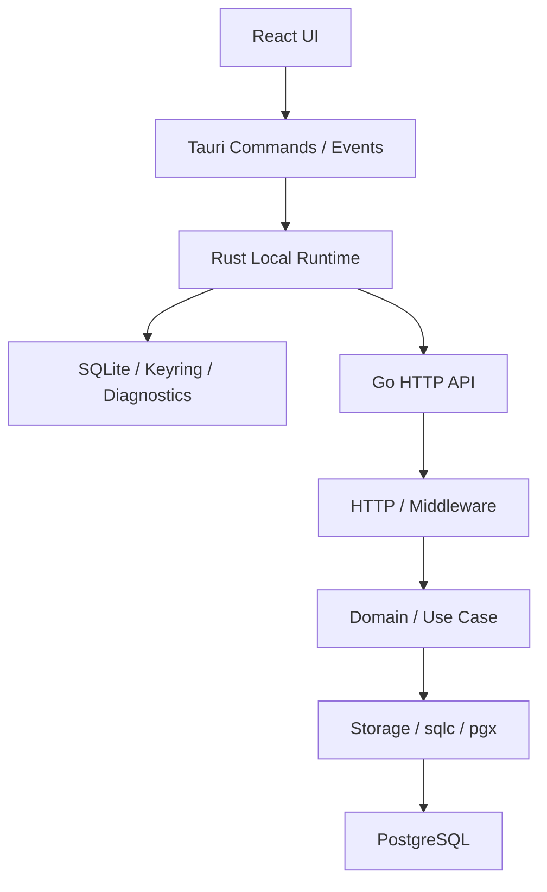

# AigcFox 系统架构基线

## 文档定位

本文档冻结当前项目的新架构骨架边界。

当前只承认以下主链：

```text
React UI -> Rust local runtime -> Go backend -> PostgreSQL
```

## 当前冻结结论

- 前端 UI、命令边界、本地运行时和远端控制面分层固定
- 默认主通信方式为 `React -> Tauri commands -> Rust -> Go HTTP API`
- Rust 层负责本地高权限能力、本地 SQLite 和错误归一
- Go 层负责 HTTP API、远端业务规则和 PostgreSQL 真相
- 当前没有激活异步队列、消息队列或独立后台作业体系

## 系统整体架构图



## 模块职责说明

| 模块 | 负责什么 | 不负责什么 |
| --- | --- | --- |
| React UI | 页面展示、交互、路由、视图状态。 | 不直接访问 SQLite，不直接持有敏感凭据，不直接写业务 SQL。 |
| `src/lib/runtime/*` | 封装 renderer 到 desktop runtime 的调用入口，屏蔽 Tauri / browser mock 差异。 | 不承载业务规则，不让页面散落原始 `invoke`。 |
| Tauri Commands | 作为 React 与 Rust 的受控边界，接收参数并调用 runtime。 | 不替代 Rust runtime 承担复杂编排。 |
| Rust Local Runtime | 本地高权限能力、本地 SQLite、secure store、远端转发和错误归一。 | 不替代 Go 成为远端权威业务真相。 |
| Local SQLite | 用户偏好、本地缓存、同步标记、离线辅助数据。 | 不存储认证令牌，不存储远端权威业务真相。 |
| Go HTTP API | 请求解析、中间件、领域编排、统一响应与错误码。 | 不承接本地存储，不把系统高权限能力暴露给前端。 |
| PostgreSQL | 远端权威数据、事务一致性、跨端共享状态。 | 不负责客户端视图态和本地缓存。 |

## 一次完整用户操作的数据流向

以下以“客户端读取本地诊断快照并展示 `sync_cache` 与 `secureStore` skeleton 状态”为例：

1. React 页面触发一个受控 command。
2. `src/lib/runtime/*` 调用 desktop runtime。
3. Rust command 接收参数并调用 local runtime。
4. local runtime 读取 SQLite 中的 `user_preferences` 与 `sync_cache` 统计，并组装 secure store 诊断快照。
5. local runtime 组装统一 `DiagnosticsSnapshot`。
6. Rust command 将统一结果或统一错误返回给 TypeScript。
7. React 页面更新 UI。

## 本地数据与远端数据边界

### 只存本地 SQLite

- 用户偏好与布局配置
- 本地诊断快照
- 本地缓存副本
- 同步辅助标记
- 离线展示所需的轻量数据

### 只存 PostgreSQL

- 远端权威业务数据
- 云端配置真相
- 审计真相
- 跨端共享状态

### 双边都有，但以远端为准

- 远端对象缓存
- 摘要列表快照
- 需要离线回显的数据副本

规则：

- 双边同时存在的数据，PostgreSQL 为最终真相
- SQLite 只服务本地体验和同步辅助

## 前后端通信方式

### 默认方式：Tauri command

以下场景默认必须走 command：

- 需要读写 SQLite
- 需要 secure store / keyring
- 需要把远端调用与本地缓存串成一条链
- 需要统一错误转换

### 受控例外：直接 HTTP

只有同时满足以下条件，前端才允许直接发 HTTP：

- 纯远端读取
- 不需要本地高权限能力
- 不需要本地 SQLite 或 secure store
- 当前文档明确允许

当前默认原则仍然是：能走 command，就不散落 direct HTTP。

## 错误传递链路

错误链固定如下：

```text
Go error response -> Rust runtime error -> Tauri command error -> TypeScript error object
```

当前最小错误结构：

```json
{
  "ok": false,
  "error": {
    "code": "invalid_request",
    "message": "请求参数不合法",
    "requestId": "req_123"
  }
}
```

规则：

- Go 负责权威错误码
- Rust 负责安全裁剪与错误归一
- TypeScript 只处理统一错误对象

## 当前架构硬约束

- Backend：`Go`、`chi + net/http`、`pgx/v5`、`sqlc`、`goose`、`PostgreSQL`
- Desktop：`Tauri 2`、`React + TypeScript`、`Rust local runtime`、`shadcn/ui`
- Local DB：`rusqlite (bundled) + rusqlite_migration`
- 当前不激活 `Redis`、消息队列或真实后台作业体系

## 使用出口

- API 契约见 [api.md](./api.md)
- 本地 SQLite 契约见 [local-schema.md](./local-schema.md)
- 研发流程见 [workflow.md](./workflow.md)
- 架构决策见 [adr/README.md](./adr/README.md)
